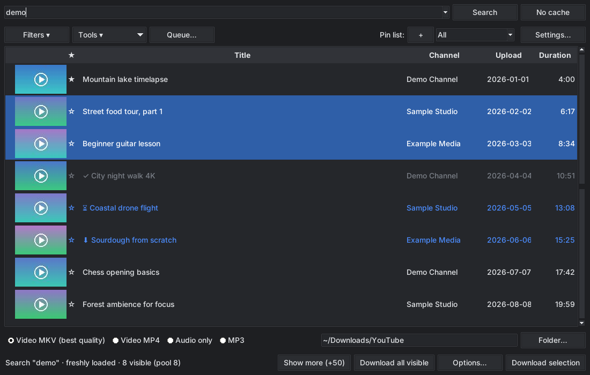

<p align="center">
  
</p>

<h1 align="center">ytpick</h1>

<p align="center">
  Desktop-Anwendung zum Suchen, Auswählen und Herunterladen von YouTube-Videos in bester Qualität.<br>
  Grafische Oberfläche für <a href="https://github.com/yt-dlp/yt-dlp">yt-dlp</a>.<br>
  <a href="README.md">English</a>
</p>

<p align="center">
  <br>
  <sub>Screenshot mit Demodaten (englische Oberfläche)</sub>
</p>

## Funktionen

- Suche mit bis zu 50 sichtbaren Treffern aus einem Pool von 150, sortierbar nach jeder Spalte
- Kanalsuche per `@handle` oder Kanal-URL, optional mit Titelfilter
- Download-Warteschlange mit Fortschritt, Pause und Abbrechen
- Optionen pro Download: maximale Auflösung, eingebettete Untertitel und Kapitel, Ordner pro Kanal
- Playlists: Playlist-URL einfügen und die ganze Liste in die Warteschlange legen
- Ausschnitt laden: nur ein Zeitbereich eines Videos
- Cover und Metadaten einbetten (MP3, MP4, MKV)
- Filter nach Dauer, Zeitraum und verifizierten Kanälen
- Warnung vor erneutem Download mit dem zuletzt genutzten Format
- Verlauf der geladenen Dateien mit Datei öffnen und Ordner zeigen
- Statistik: Downloads gesamt, Videos und Musik, nach Zeitraum, Kanal und Monat, Gesamtgröße und Laufzeit
- Geschwindigkeitslimit und optionales Zeitfenster (zum Beispiel nur nachts) für die Warteschlange
- Schlägt bei einem Bot-Check die Cookies eines installierten Browsers vor
- Kanäle beobachten und neue Videos seit der letzten Prüfung anzeigen
- Videos in benannte Merklisten merken; gemerkte Videos stehen oben und bleiben bei neuen Suchen erhalten
- Suchverlauf im Suchfeld, YouTube-Links aus der Zwischenablage werden automatisch angeboten
- Dateinamen-Muster wählbar (Titel, Kanal und Titel oder Nummer und Titel)
- Ton nach Ende der Warteschlange, optional danach den PC herunterfahren
- Optionale Vorschaubilder in der Trefferliste
- Spalten und ihre Reihenfolge in den Einstellungen wählen
- Hinweis auf verifizierte Kanäle, sofern YouTube die Angabe liefert
- Videos ausblenden, Kanäle blockieren; Blockliste mit Zeitstempel, Entsperren und Protokoll
- Bereits geladene Videos werden erkannt und markiert; jede fertige Datei wird gegen die gewählte Video-ID geprüft
- Cache für Suchergebnisse und Upload-Daten, schont die Abfragelimits von YouTube
- Download als MKV (beste Qualität), MP4, MP3 oder nur Audio
- Dark Mode, Kurzanleitung und Systemcheck beim Start
- Anmeldung über die Cookies eines installierten Browsers
- Oberfläche auf Deutsch und Englisch
- yt-dlp-Update per Klick in der Kurzanleitung
- Terminal-Version `ytpick-cli` für Linux, macOS und Windows

## Voraussetzungen

| Komponente | Zweck |
| --- | --- |
| Python 3.10 oder neuer mit tkinter | Programm (Linux: Paket `python3-tk`) |
| [ffmpeg](https://ffmpeg.org) | Video und Ton zusammenführen |
| [Deno](https://deno.com) | JavaScript-Laufzeit, die yt-dlp für YouTube benötigt |
| [yt-dlp](https://github.com/yt-dlp/yt-dlp) | Suche und Download, wird per pip installiert |
| [Pillow](https://python-pillow.org) (optional) | Vorschaubilder |

## Installation

### Windows

**Variante A: ausführbare Datei.** `ytpick-x.y.z-windows.exe` aus dem Bereich *Releases* herunterladen und starten. Python wird nicht gebraucht. ffmpeg und Deno müssen weiterhin installiert sein:

```
winget install Gyan.FFmpeg DenoLand.Deno
```

Die Datei ist nicht signiert, deshalb kann Windows SmartScreen beim ersten Start warnen. yt-dlp ist fest eingebaut; aktualisiert wird durch das Herunterladen der neuesten Version.

**Variante B: Installer.**

1. ZIP-Datei aus dem Bereich *Releases* herunterladen und entpacken.
2. `setup.bat` ausführen.

Das Skript installiert fehlende Komponenten über winget, aktualisiert yt-dlp und legt Verknüpfungen auf dem Desktop und im Startmenü an.

### Linux

**Variante A: Programmdatei.** Lade `ytpick-x.y.z-linux-x86_64.tar.gz` aus dem Bereich *Releases*, entpacke sie und starte `./ytpick` (grafisch) oder `./ytpick-cli` (Terminal). Python ist nicht nötig. ffmpeg und Deno müssen weiterhin installiert sein, zum Beispiel `sudo apt install ffmpeg` und das [Deno-Installationsskript](https://deno.com). Die Programme sind unter Ubuntu 22.04 gebaut und brauchen eine ähnlich aktuelle glibc.

**Variante B: pipx.** Siehe unten. Die grafische Version braucht das Paket `python3-tk`.

### pipx

```
pipx install "ytpick[thumbnails] @ git+https://github.com/cybtide/ytpick"
ytpick
ytpick-cli --help
```

ffmpeg und Deno müssen separat installiert sein. Ohne Vorschaubilder entfällt `[thumbnails]`.

### Manuell

```
pip install -r requirements.txt
python ytpick.py
```

## Bedienung

| Eingabe | Ergebnis |
| --- | --- |
| `suchbegriff` | Videosuche |
| `@kanalname` | Neueste Videos des Kanals |
| `@kanalname begriff` | Videos des Kanals mit dem Begriff im Titel |
| Kanal-URL | Videos des Kanals |
| Video-Link (`youtu.be/...`, `watch?v=...`) | Dieses Video |
| Playlist-URL (`youtube.com/playlist?list=...`) | Alle Videos der Playlist, bis zu 300 |

| Aktion | Bedienung |
| --- | --- |
| Suche aus dem Cache | Enter |
| Suche ohne Cache | Umschalt + Enter oder Schaltfläche *Ohne Cache* |
| Mehrere Videos wählen | Strg- oder Umschalttaste |
| Video ausblenden | Entf |
| Video merken | Leertaste oder Klick auf den Stern |
| Kontextmenü | Rechtsklick |
| Herunterladen | Doppelklick oder Schaltfläche *Auswahl herunterladen* |
| Herunterladen mit Optionen | *Optionen…* oder Kontextmenü |
| Sortieren | Klick auf eine Spaltenüberschrift |

## Bot-Prüfung von YouTube

Meldet YouTube `Sign in to confirm you're not a bot`, wähle in den Einstellungen bei *Cookies aus Browser* einen Browser, in dem du bei YouTube angemeldet bist. Firefox funktioniert am zuverlässigsten. Chrome und Edge müssen unter Windows teilweise vollständig geschlossen sein.

## Gespeicherte Daten

Alle Dateien liegen im Benutzerverzeichnis.

| Datei | Inhalt |
| --- | --- |
| `.ytdl_gui.json` | Einstellungen, Download-Historie, gemerkte und ausgeblendete Videos, blockierte und beobachtete Kanäle, geladene Dateien |
| `.ytdl_gui_cache.json` | Zwischengespeicherte Suchergebnisse und Upload-Daten |
| `.ytdl_gui_thumbs/` | Zwischengespeicherte Vorschaubilder |
| `.ytdl_gui.log` | Protokoll mit Zeitstempeln |

## Kommandozeile

`ytpick-cli` ist die Terminal-Version ohne Fenster und ohne tkinter. Nach `pipx install` steht sie als Befehl bereit, sonst startest du `python ytpick_cli.py`.

```
ytpick-cli "suchbegriff"
ytpick-cli "suchbegriff" -n 20 --mp4
ytpick-cli @kanalname tutorial --mp3 --embed
ytpick-cli "https://www.youtube.com/playlist?list=..." --all -o ~/Musik
ytpick-cli "https://www.youtube.com/watch?v=..." --cut 1:20-3:45
ytpick-cli "suchbegriff" --list
ytpick-cli --help
```

Sie versteht dieselben Eingaben wie das Fenster (Suchbegriff, `@Kanal` mit Filterwort, Kanal-, Playlist- und Video-URLs). Die Treffer sind nummeriert; wähle mit `1,3`, `2-4` oder `all`, mit `m` kommen mehr Treffer. `--pick 1,3`, `--all` und `--list` laufen ohne Rückfragen, also auch in Skripten; der Exitcode ist 1, wenn ein Download fehlgeschlagen ist. Weitere Optionen: `--mp4`, `--mp3`, `--audio`, `--max-height`, `--cut`, `--embed`, `--chapters`, `--subs`, `--name`, `--channel-folder`, `--cookies`, `--rate`.

## Entwicklung

```
pip install -e ".[thumbnails]"
python -m unittest discover -s tests -v
```

Die Tests, die das Fenster öffnen, brauchen eine Anzeige (unter Linux zum Beispiel `xvfb-run`).

## Hinweise zur Nutzung

ytpick ist ein unabhängiges Projekt und steht in keiner Verbindung zu YouTube oder Google. Lade nur Inhalte herunter, zu deren Vervielfältigung du berechtigt bist, und beachte die Nutzungsbedingungen von YouTube sowie das in deinem Land geltende Recht.

yt-dlp, ffmpeg und Deno sind eigenständige Projekte mit eigenen Lizenzen. Sie sind nicht Bestandteil dieses Repositorys.

## Versionierung und Releases

ytpick folgt [Semantic Versioning](https://semver.org/lang/de/). Die installierte Version zeigt `ytpick --version` sowie die Kurzanleitung im Programm. Änderungen stehen im [Changelog](CHANGELOG.md).

Ein Release entsteht so:

1. `__version__` in `ytpick.py` erhöhen.
2. In `CHANGELOG.md` einen Abschnitt `## [x.y.z] - JJJJ-MM-TT` ergänzen.
3. Änderungen committen, Tag `vx.y.z` setzen und pushen.

Der Release-Workflow prüft, ob Tag, Version und Changelog zusammenpassen, und veröffentlicht das Windows-Paket mit den Release-Notizen aus dem Changelog.

## Lizenz

[MIT](LICENSE)
